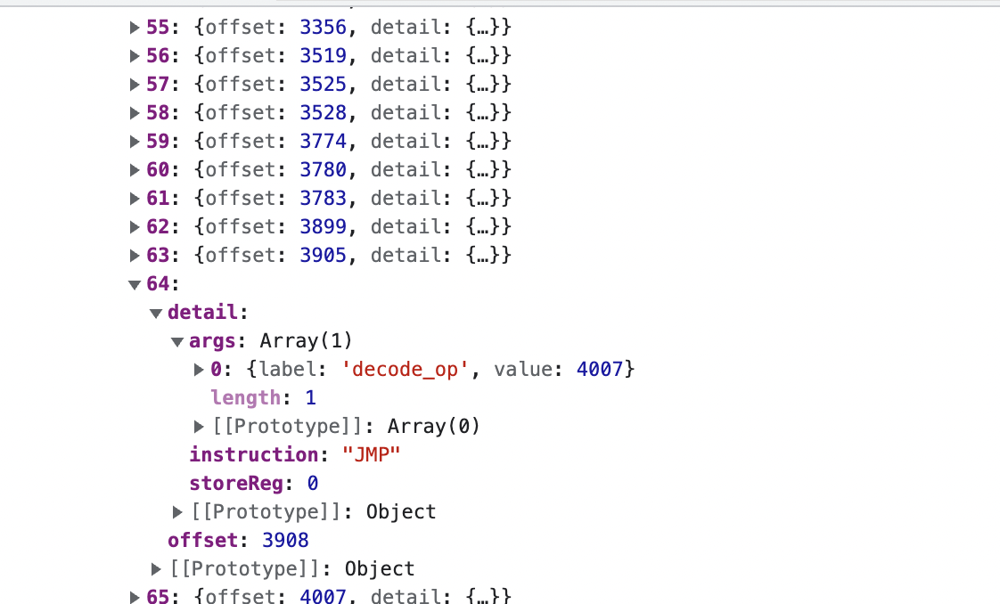

## Kasada Dissembler

A simple kasada dissembler which is capable of tracing through and executing every single opcode in kasada's bytecode and then logging it into a call stack replacing each with a human readable instruction label along with the parameters, registers or decode calls it accesses.

The code is a heavily modified version of kasada's virtual machine interpreter with most of the junk code and obfuscation removed, it isn't meant to be a full deobfuscator but a tool to aid with reverse engineering the virtual machine / to make writing a full bytecode to javascript decompiler a bit easier.

## Features

- Full mapping of every single opcode into a human readable instruction
- Full parameter coverage for all instructions, including if the value was retrieved from a register or decoded from the bytecode
- Simplified binary obfuscations in helper functions
- Removed junk code

## Explanation of Trace

- **Offset** : Location of specified opcode 
- **Decode_Op** : Means the value was retrieved from decoding a part of the opcode
- **Store_Reg** : The register which the value is being stored to
- **Register** : The register that was used to fetch the argument value

## Usage 

1) Open a chrome incognitio window 
2) Run the dissembler.js script in console

It will provide you a full trace of every single opcode executed along with the parameter details and offset location.

